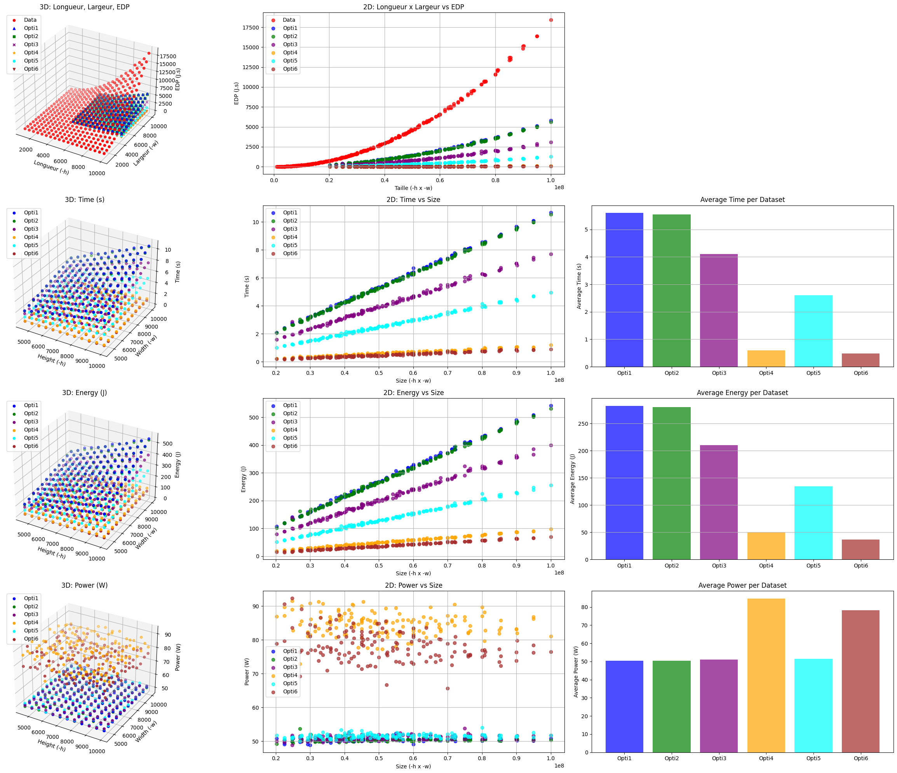

# SE-ENER

## Description

**SE-ENER** est le fruit d’un projet universitaire. Il regroupe plusieurs outils et applications dédiés à l’analyse de performances, avec un accent particulier sur la consommation énergétique et l’optimisation des algorithmes.



### Composants du Projet

1. **app_analyse** : Une application en C permettant de surveiller la consommation énergétique d’une commande ou application via MojitO/S.
2. **fractal** : Un générateur de fractales implémenté en C, proposant plusieurs algorithmes. Il utilise des techniques avancées comme SIMD (AVX, AVX-512) et la parallélisation multicœur.
3. **mojitos** : Un module développé par l’IRIT pour la collecte des données énergétiques. Plus d'informations : [MojitO/S](https://gitlab.irit.fr/sepia-pub/mojitos).
4. **result** : Ce répertoire contient les analyses et visualisations des données collectées.

> Je vous recommande de consulter les fichiers `README.md` dans les répertoires `app_analyse` et `fractal` pour des informations détaillées, ainsi que le notebook Jupyter dans `result` pour explorer les analyses.

## Arborescence

```
.
├── app_analyse          # Application pour surveiller la consommation énergétique
│   ├── app.c
│   ├── Makefile
│   ├── README.md
│   └── test.sh
├── fractal              # Générateur de fractales en C
│   ├── algo.h
│   ├── algo_opti1.c
│   ├── algo_opti2.c
│   ├── algo_opti3.c
│   ├── algo_opti4.c
│   ├── algo_opti5.c
│   ├── algo_opti6.c
│   ├── algo_simple.c
│   ├── bmp.c
│   ├── bmp.h
│   ├── fractal.c
│   ├── Makefile
│   └── README.MD
├── mojitos              # Sous-module pour MojitO/S
│   └── ...
├── result               # Données et analyses
│   ├── analyse.ipynb
│   └── ...
├── Makefile             # Makefile principal pour le projet
└── README.md            # Ce fichier
```

## Installation

### Cloner le Dépôt

Pour cloner le dépôt avec ses sous-modules, utilisez la commande suivante :

```bash
git clone --recurse-submodules https://github.com/HDwayne/SE-ENER
```

Si vous avez déjà cloné le dépôt sans sous-modules, utilisez :

```bash
git submodule update --init --recursive
```

### Compilation

Pour compiler toutes les applications, exécutez simplement :

```bash
make
```

Cela compilera les composants dans `app_analyse` et `fractal`.

> **Note** : Assurez-vous d'avoir compilé mojitO/S avant.

### Nettoyage

Pour nettoyer tout le projet, utilisez :

```bash
make clean
```

## Utilisation

### Exécution des Applications

Pour exécuter les applications et sauvegarder les résultats avec un nom spécifique :

```bash
make test NAME=<nom_du_test>
```

Les données générées seront enregistrées dans le répertoire `result/`.